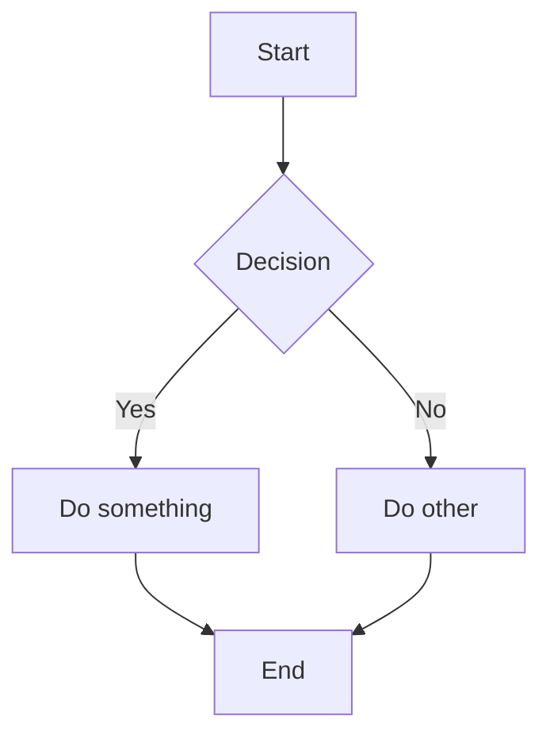

欢迎来到 **HomeBlog**。

:::tip
测试
:::

:::caution
测试
:::

:::info
测试
:::

:::danger
测试
:::

:::note
测试
:::

## Code Block

```ts
export function sum(a: number, b: number) {
  return a + b;
}
```

## KaTeX

行内公式 $E=mc^2$，块级公式：

$$
\int_0^1 x^2 \, dx = \frac{1}{3}
$$

## Mermaid

